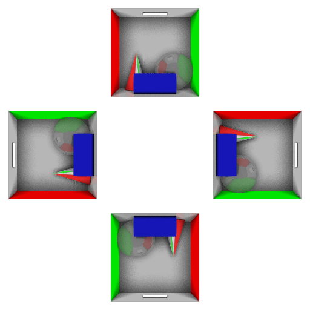

# Holography Plugin

## Description
The Holography plugin is a 4-view virtual camera for creating holographic compatible media. It is implemented as a plugin for [Blue Brain Brayns](https://github.com/BlueBrain/Brayns), the Blue Brain rendering platform.

## Contact

For more information on the Holopgraphic plugin, please contact:

__Cyrille Favreau__  
[cyrille.favreau@gmail.com](cyrille.favreau@gmail.com) 
